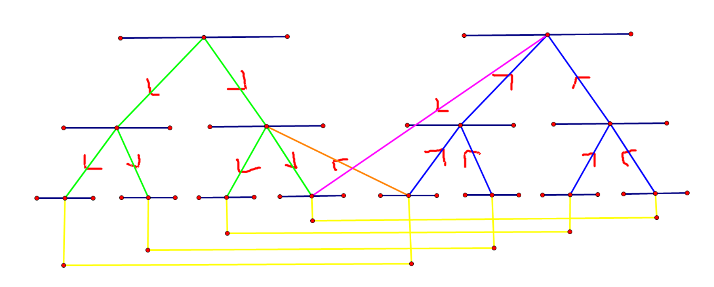

# 线段树优化建图



处理需要区间所有点向某个点连边，或者反之的图论问题时，用一颗线段树优化区间建边。

以最短路为例（既存在区间所有点向某个点连边，又存在某个点向区间所有点连边时要开两颗线段树，建成的图如上所示）。此时add一组边的复杂度为log。如果只存在区间所有点向某个点连边或者存在某个点向区间所有点连边，只用开一颗线段树，也会好写许多。

```cpp
#include<bits/stdc++.h>
#define ls i<<1
#define rs i<<1|1
using namespace std;
typedef long long ll;
const int offset = 500000;
ll ans[1000005];
namespace Dij{
    ll dist[1000005];
    int vis[1000005];
    struct edge{
        int v;
        ll  w;
    };
    vector<edge>G[1000005];
    struct node{
        int v;
        ll  w;
        friend bool operator < (node a, node b) {
            return a.w > b.w;
        }
    }fa, son;

    inline void add(int u, int v, int w) {
        G[u].push_back({v, w});
    }

    void dijkstra(int s) {
        memset(vis, 0, sizeof(vis));
        memset(dist, 0x3f, sizeof(dist));
        priority_queue<node>q;
        dist[s] = 0;
        q.push({s, 0});
        while (!q.empty()) {
            fa = q.top();
            q.pop();
            if (vis[fa.v])continue;
            vis[fa.v] = 1;
            for (edge e:G[fa.v]) {
                if (fa.w + e.w < dist[e.v]) {
                    dist[e.v] = fa.w + e.w;
                    q.push({e.v, dist[e.v]});
                }
            }
        }
    }
}
using namespace Dij;
struct node{
    int l, r;
}tree[400005];
int id[100005];
void build(int i, int l, int r) {
    tree[i].l = l;
    tree[i].r = r;
    if (l == r) {
        id[l] = i;
        return;
    }
    int mid = (l + r) / 2;
    build(ls, l, mid);
    build(rs, mid + 1, r);
    add(i, ls, 0);
    add(i, rs, 0);
    add((ls) + offset, i + offset, 0);
    add((rs) + offset, i + offset, 0);
}
void add(int opt, int i, int l, int r, int v, int w) {
    if (tree[i].l > r || tree[i].r < l) {
        return;
    }
    if (tree[i].l >= l && tree[i].r <= r) {
        if (!opt) {
            add(id[v] + offset, i, w);
        } else {
            add(i + offset, id[v], w);
        }
        return;
    }
    add(opt, ls, l, r, v, w);
    add(opt, rs, l, r, v, w);
}
int main() {
    int n, q, s; scanf("%d%d%d", &n, &q, &s);
    build(1, 1, n);
    for (int i = 1; i <= q; ++i) {
        int opt; scanf("%d", &opt);
        if (opt == 1) {
            int u, v, w; scanf("%d%d%d", &u, &v, &w);
            add(id[u], id[v] + offset, w);
        } else if(opt == 2) {
            int v, l, r, w; scanf("%d%d%d%d", &v, &l, &r, &w);
            add(0, 1, l, r, v, w);
        } else if(opt == 3) {
            int v, l, r, w; scanf("%d%d%d%d", &v, &l, &r, &w);
            add(1, 1, l, r, v, w);
        }
    }
    for (int i = 1; i <= n; ++i) {
        add(id[i], id[i] + offset, 0);
        add(id[i] + offset, id[i], 0);
    }
    dijkstra(id[s]);
    for (int i = 1; i <= n; ++i) {
        if (dist[id[i]] >= 1e15) {
            printf("-1 ");
        } else {
            printf("%lld ", dist[id[i]]);
        }
    }
    puts("");
    return 0;
}
```